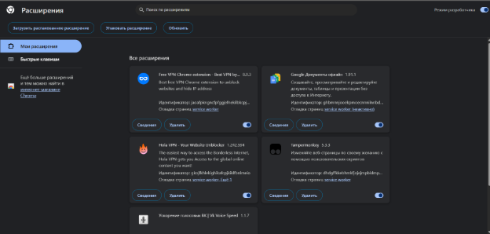
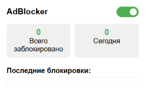

Разработка собственный блокировщик рекламы для браузера на JavaScript.

Исследование предметной области:

Блокировщик рекламы — это программа или расширение браузера, которое предотвращает загрузку и отображение рекламы на веб-страницах. Они могут использовать различные методы для достижения этой цели.

Методы блокировки рекламы

- Фильтрация по URL: Блокировщики используют списки фильтров (например, EasyList), чтобы блокировать запросы к известным доменам рекламодателей.
- CSS и JavaScript: Некоторые блокировщики могут скрывать элементы на странице с помощью CSS или JavaScript.
- Анализ DOM: Блокировщики могут анализировать структуру документа (DOM) и удалять элементы, которые соответствуют определенным критериям.

  Технологии и инструменты:

- JavaScript: Основной язык программирования для создания блокировщиков.
- Расширения браузеров: Например, AdBlock, uBlock Origin, которые могут быть написаны на JavaScript и использовать API браузера.
- Списки фильтров: Используются для определения, какие элементы блокировать.

  Есть проблемы, которые необходимо учитывать при разработке блокировщика. Первая проблема - обход блокировщиков. Рекламодатели разрабатывают методы обхода блокировщиков, например, через обфускацию кода. Это может существенно осложнить разработку. Вторая проблема - влияние блокировщика на производительность сайта. Блокировщики могут замедлять загрузку страниц, если они реализованы неэффективно. Поэтому нужно тщательно подойти к написанию кода

  Руководство пользователя

  Данное расширение будет работать только в браузерах на базе Chromium, например, Chrome, Brave, Opera, Microsoft Edge и т. д. Оно не будет работать в Firefox или Safari.

  Чтобы все было совсем просто, наше расширение на самом деле не будет иметь всплывающего окна (маленького окна, которое появляется при нажатии на значок расширения) — оно просто будет работать в фоновом режиме.

  Таким образом, нам действительно нужны всего 3 файла. Это: manifest.json, background.js и linkedin.js.

  **Шаг 1 – создание файла manifest.json**

  manifest.json – единственный необходимый файл, который нужен расширению. Он будет содержать метаданные о расширении, разрешения, необходимые для работы, и скрипт, который он должен запустить в фоновом режиме. Вот как это выглядит:
{
      "manifest_version": 2,
      "name": "LinkedIn AdBlocker",
      "description": "Blocking ads.",
      "version": "0.0.1",
      "author": "<AUTHOR_NAME>",
      "browser_action": {
          "default_title": "LinkedIn AdBlocker"
      },
      "permissions": [
          "tabs",
          "webNavigation",
          "https://www.linkedin.com/"
      ],
      "background": {
          "scripts": [
              "extension.js"
          ]
      }
  }

  Помимо метаданных, манифест настраивает разрешения. *Permissions* определяет, что разрешено делать расширению, например, получать URL-адрес текущей страницы или добавлять JavaScript на веб-сайт. Когда публикуется расширение где-либо, например, в Chrome Web Store, браузер предложит обосновать каждое запрашиваемое разрешение, чтобы обеспечить безопасность и конфиденциальность пользователей.

  Здесь же запрашивается разрешения для tabs и webNavigation для того, чтобы знать, когда посещается новый веб-сайт, а также что это за веб-сайт. 

  **Шаг 2 – создание файла background.js**

  Background.js - определяет скрипты, которые должны запускаться при срабатывании определенных событий. Ключевое событие, которое большинство расширений прослушивают в той или иной степени, — это загрузка новой веб-страницы.

  В данном случае мы будем отслеживать изменения навигации и получать URL-адрес каждого нового запрошенного веб-сайта.

  Здесь мы настроим наш прослушиватель событий, который будет запускать действие каждый раз, когда пользователь загружает новую веб-страницу. 

  /\*Это событие срабатывает в начале загрузки страницы.

  `    `В отличие от, например, webNavigation.onCompleted, оно происходит рано, давая нам возможность сразу приступить к удалению рекламы\*/

  chrome.webNavigation.onCommitted.addListener(function (tab) {

  `  `// Запрещает запуск скрипта во время загрузки других фреймов

  `  `if (tab.frameId == 0) {

  `      `chrome.tabs.query({ active: true, lastFocusedWindow: true }, tabs => {

  `          `// Получает URL страницы

  `          `let url = tabs[0].url;

  `          `// Удаляет из URL необязательные определения протоколов и поддомен www

  `          `let parsedUrl = url.replace("https://", "")

                .replace("http://", "")

                .replace("www.", "")

  `          `// Удаляет путь и запросы, например linkedin.com/feed либо linkedin.com?query=value

  `          `// Нам нужен только базовый домен

  `          `let domain = parsedUrl.slice(0, parsedUrl.indexOf('/') == -1 ? parsedUrl.length : parsedUrl.indexOf('/'))

                .slice(0, parsedUrl.indexOf('?') == -1 ? parsedUrl.length : parsedUrl.indexOf('?'));

  `          `try {

  `              `if (domain.length < 1 || domain === null || domain === undefined) {

  `                  `return;

  `              `} else if (domain == "linkedin.com") {

  `                  `runLinkedinScript();

  `                  `return;

  `              `}

  `          `} catch (err) {

  `              `throw err;

  `          `}

  `      `});

  `  `}

  });

  function runLinkedinScript() {

  `  `// Встраивает в страницу скрипт из файла

  `  `chrome.tabs.executeScript({

  `      `file: 'linkedin.js'

  `  `});

  `  `return true;

  }

  **Шаг 3 – создание файла linkedin.js**

  linkedin.js - определяет, как на самом деле блокировать рекламу. Вот как это выглядит:

  function removeAds() {

  `  `// Получает все элементы 'span' на странице

  `  `let spans = document.getElementsByTagName("span");

  `  `for (let i = 0; i < spans.length; ++i) {

  `      `// Проверяет, содержат ли они текст 'Promoted'

  `      `if (spans[i].innerHTML === "Promoted") {

  `          `// Получает div, который обёртывает рекламную вставку

  `          `let card = spans[i].closest(".feed-shared-update-v2");

  `          `// если класс изменился, и мы не можем найти его при помощи closest(), получает 6-го предка

  `          `if (card === null) {

  `              `// Может также быть card.parentNode.parentNode.parentNode.parentNode.parentNode.parentNode :D

  `              `let j = 0;

  `              `card = spans[i];

  `              `while (j < 6) {

  `                  `card = card.parentNode;

  `                  `++j;

  `              `}

  `          `}

  `          `// Удаляет рекламу!

  `          `card.setAttribute("style", "display: none !important;");

  `      `}

  `  `}

  }

  removeAds();

  // Обеспечивает, чтобы реклама удалялась по мере прокрутки страницы

  setInterval(function () {

  `  `removeAds();

  }, 100)

  Здесь мы перебираем все span элементы в поисках тех, которые содержат текст «Promoted», пытаемся получить div, который обтекает рекламу двумя разными способами, а затем избавляемся от него, устанавливая display: none;.

  Чтобы найти правильного предка, мы сначала используем встроенный метод для HTML-элементов, называемый closest. Он будет перебирать предков нашего span, пока не найдет первого с классом feed-shared-update-v2. 

  Мы также используем простой способ, чтобы гарантировать удаление рекламы, которая динамически загружается по мере прокрутки страницы пользователем, запуская setInterval скрипт каждые 100 мс.

  **Шаг 4 - Добавление расширения в ваш браузер**

1. Нажмите на «бургер-меню» вашего браузера в правом верхнем углу или перейдите напрямую в «Настройки».
1. Перейдите в раздел «Расширения».
1. Включите «Режим разработчика», который обычно находится в правом верхнем углу страницы «Расширения».
1. Некоторые кнопки должны были появиться в верхней части страницы. Нажмите «Загрузить распакованное».
1. Выберите каталог вашего проекта в браузере файлов.
1. Все готово!

   Если вы правильно выполнили все шаги, у вас должен появиться новый значок в месте расположения ваших расширений, также в правом верхнем углу. Поскольку мы не задали для него значок, скорее всего, это будет буква «L» внутри квадрата.

   Вот так выглядит браузер в режиме разработчика

   

   Модификация блокировщика

   Вы можете написать html – код, который задаст внешний вид блокировщика, а также выбрать ему иконку, которая будет отображаться в браузере.

   Пример html-кода

   <!DOCTYPE html>

   <html lang="ru">

   <head>

   `  `<meta charset="UTF-8">

   `  `<meta name="viewport" content="width=device-width, initial-scale=1.0">

   `  `<title>AdBlocker</title>

   `  `

   </head>

   <body>

   `  `

   `    `<h3 style="margin: 0;">AdBlocker</h3>

   `    `<label class="switch">

   `      `<input type="checkbox" id="toggle" checked>

   `      `

   `    `</label>

   `  `

   `  `

   `    `

   `      `
0

   `      `
Всего заблокировано

   `    `

   `    `

   `      `
0

   `      `
Сегодня

   `    `

   `  `

   `  `<h4 style="margin-bottom: 5px;">Последние блокировки:</h4>

   `  `

   `    `<!-- Список будет заполняться динамически -->

   `  `

   `  `

   </body>

   </html>

   Вот так теперь будет выглядеть блокировщик.

   

   Чтобы подключить данный код, необходимо изменить файл manifest.json. Теперь он будет выглядеть так:

   {

   `  `"manifest\_version": 2,

   `  `"name": "AdBlocker",

   `  `"description": "Blocking ads.",

   `  `"version": "0.0.1",

   `  `"author": "Голданова Л.В.",

   `  `"browser\_action": {

   `    `"default\_title": "Блокировщик рекламы",

   `    `"default\_icon": "icon.png",

   `    `"default\_popup": "index.html"

   `  `},

   `  `"permissions": [

   `    `"activeTab",

   `    `"webNavigation",

   `    `"storage",

   `    `"webRequest",

   `    `"webRequestBlocking",

   `    `"<all\_urls>"

   `  `],

   `  `"background": {

   `    `"scripts": ["background.js"],

   `    `"persistent": true

   `  `},

   `  `"content\_scripts": [

   `    `{

   `      `"matches": ["<all\_urls>"],

   `      `"js": ["linkedin.js"],

   `      `"run\_at": "document\_end"

   `    `}

   `  `]

   }

   Обратите внимание, что мы указали нашу html - страницу в строке "default\_popup": "index.html". чтобы добавить иконку, скачайте ее в интернете и пропишите строчку для ее добавления - "default\_icon": "icon.png".

   Также необходимо добавить скрипт, который будет взаимодействовать и с html- страницей, и с основными js скриптами. Вы можете назвать его как хотите. Данный код будет считывать количество заблокированных реклам, а также указывать их url. Пример кода для представленной html-страницы:

   document.addEventListener('DOMContentLoaded', function() {

   `  `const toggle = document.getElementById('toggle');

   `  `const totalBlockedEl = document.getElementById('totalBlocked');

   `  `const todayBlockedEl = document.getElementById('todayBlocked');

   `  `const blockedItemsEl = document.getElementById('blockedItems');

   `  `// Загрузка состояния

   `  `chrome.storage.local.get(['enabled', 'stats'], function(data) {

   `    `toggle.checked = data.enabled !== false;

   `    `updateStats(data.stats);

   `  `});

   `  `// Обновление статистики

   `  `function updateStats(stats) {

   `    `if (!stats) return;

    

   `    `totalBlockedEl.textContent = stats.totalBlocked || 0;

    

   `    `// Подсчет блокировок за сегодня

   `    `const today = new Date().toDateString();

   `    `const todayCount = stats.lastBlocked ? 

   `      `stats.lastBlocked.filter(item => 

   `        `new Date(item.timestamp).toDateString() === today

   `      `).length : 0;

   `    `todayBlockedEl.textContent = todayCount;

    

   `    `// Обновление списка

   `    `blockedItemsEl.innerHTML = '';

   `    `if (stats.lastBlocked) {

   `      `stats.lastBlocked.forEach(item => {

   `        `const div = document.createElement('div');

   `        `div.className = 'blocked-item';

   `        `div.textContent = `${item.url} (${item.selector || item.type})`;

   `        `blockedItemsEl.appendChild(div);

   `      `});

   `    `}

   `  `}

   `  `// Слушаем изменения хранилища

   `  `chrome.storage.onChanged.addListener(function(changes) {

   `    `if (changes.stats) {

   `      `updateStats(changes.stats.newValue);

   `    `}

   `  `});

   `  `// Переключение

   `  `toggle.addEventListener('change', function() {

   `    `chrome.storage.local.set({ enabled: this.checked });

   `    `chrome.tabs.query({ active: true, currentWindow: true }, function(tabs) {

   `      `chrome.tabs.reload(tabs[0].id);

   `    `});

   `  `});

   `  `// Первоначальная загрузка

   `  `chrome.runtime.sendMessage({type: "get\_stats"}, function(response) {

   `    `updateStats(response);

   `  `});

   });

   Также были модифицированы основные js – скрипты, к ним добавились новые функции:

   1) background\.js

   let stats = {

   `  `totalBlocked: 0,

   `  `lastBlocked: [],

   `  `lastUpdated: Date.now()

   };

   // Инициализация хранилища

   chrome.runtime.onInstalled.addListener(() => {

   `  `chrome.storage.local.set({ 

   `    `stats: stats,

   `    `enabled: true 

   `  `});

   });

   chrome.runtime.onMessage.addListener((request, sender, sendResponse) => {

   `  `if (request.type === "ad\_blocked") {

   `    `chrome.storage.local.get(['stats', 'enabled'], (result) => {

   `      `if (result.enabled !== false) {

   `        `const currentStats = result.stats || stats;

   `        `const updatedStats = {

   `          `totalBlocked: currentStats.totalBlocked + 1,

   `          `lastBlocked: [{

   `            `url: request.url,

   `            `selector: request.selector,

   `            `elementType: request.elementType,

   `            `timestamp: Date.now()

   `          `}, ...currentStats.lastBlocked.slice(0, 4)],

   `          `lastUpdated: Date.now()

   `        `};

        

   `        `chrome.storage.local.set({ stats: updatedStats }, () => {

   `          `if (chrome.runtime.lastError) {

   `            `console.error('Storage error:', chrome.runtime.lastError);

   `          `}

   `        `});

   `      `}

   `    `});

   `  `}

   `  `if (request.type === "get\_stats") {

   `    `chrome.storage.local.get(['stats'], (result) => {

   `      `sendResponse(result.stats || stats);

   `    `});

   `    `return true;

   `  `}

   });

   chrome.webRequest.onBeforeRequest.addListener(

   `  `(details) => {

   `    `if (details.url.match(/ads|adservice|doubleclick|tracking|analytics/i)) {

   `      `chrome.storage.local.get(['enabled'], (result) => {

   `        `if (result.enabled !== false) {

   `          `chrome.storage.local.get(['stats'], (res) => {

   `            `const currentStats = res.stats || stats;

   `            `const updatedStats = {

   `              `totalBlocked: currentStats.totalBlocked + 1,

   `              `lastBlocked: [{

   `                `url: details.url,

   `                `type: 'network\_request',

   `                `timestamp: Date.now()

   `              `}, ...currentStats.lastBlocked.slice(0, 4)],

   `              `lastUpdated: Date.now()

   `            `};

   `            `chrome.storage.local.set({ stats: updatedStats });

   `          `});

   `          `return { cancel: true };

   `        `}

   `      `});

   `    `}

   `  `},

   `  `{ urls: ["<all\_urls>"] },

   `  `["blocking"]

   );

   2) linkedin\.js

   const adSelectors = [

   `  `'.ad', '.ads', '.ad-container', '.ad-banner', '.ad-wrapper',

   `  `'[class\*="advert"]', '[id\*="advert"]', '[data-ad-type]',

   `  `'iframe[src\*="ads"]', 'iframe[src\*="doubleclick"]', 'iframe[src\*="adservice"]',

   `  `'.social-widget', '[id\*="social-plugin"]',

   `  `'.popup', '.modal[data-ad]',

   `  `'.video-ads', '.preroll-container'

   ];

   function blockAds() {

   `  `let blockedCount = 0;

   `  `adSelectors.forEach(selector => {

   `    `document.querySelectorAll(selector).forEach(ad => {

   `      `if (ad.style.display !== 'none') {

   `        `ad.style.display = 'none';

   `        `ad.setAttribute('data-adblocked', 'true');

   `        `blockedCount++;

   `        `chrome.runtime.sendMessage({

   `          `type: "ad\_blocked",

   `          `url: window.location.href,

   `          `selector: selector,

   `          `elementType: ad.tagName

   `        `});

   `      `}

   `    `});

   `  `});

   `  `document.querySelectorAll('script').forEach(script => {

   `    `if (script.src && /ads|adservice|doubleclick|tracking|analytics/i.test(script.src)) {

   `      `script.remove();

   `      `blockedCount++;

   `    `}

   `  `});

   `  `return blockedCount;

   }

   const observer = new MutationObserver(() => {

   `  `blockAds();

   });

   function initAdBlock() {

   `  `blockAds();

   `  `observer.observe(document, {

   `    `childList: true,

   `    `subtree: true,

   `    `attributes: false,

   `    `characterData: false

   `  `});

   }

   if (document.readyState === 'loading') {

   `  `document.addEventListener('DOMContentLoaded', initAdBlock);

   } else {

   `  `initAdBlock();

   }

   После этого расширение было снова загружено в браузер. Новый модифицированный блокировщик готов к работе.
